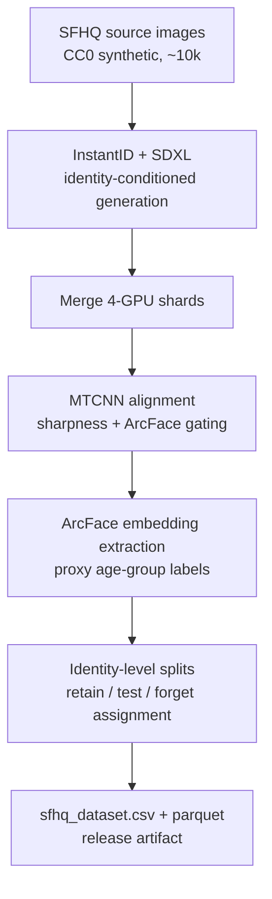

# SFHQ-InstantID: A Synthetic Identity-Conditioned Face Dataset for Machine Unlearning

[](https://huggingface.co/datasets/TODO)
[](https://doi.org/TODO)
[](LICENSE)

A reproducible pipeline for constructing **synthetic, identity-conditioned face
clusters** from CC0 synthetic seed images, designed as a benchmark for
**machine unlearning**.  Each identity cluster is a deletion unit — all images
of one synthetic identity share a split (`retain` / `test` / `forget`),
preventing identity leakage across training, evaluation, and sequential
deletion schedules.

## Dataset at a glance

| Property | Value |
|---|---|
| **Source domain** | SFHQ (CC0 synthetic portraits) |
| **Generation method** | InstantID adapter + SDXL + ControlNet |
| **Output resolution** | 128×128 RGB (aligned face crops) |
| **Identities** | 400 |
| **Images per identity** | 40 |
| **Total images** | 16,000 |
| **Splits** | Retain 300, Test 60, Forget 40 identities |
| **Forget protocol** | 40 steps (1 identity deleted per step) |
| **Labels** | `clusterid`, `agegroup` (proxy, 4 bins), `split`, `forgetstep` |
| **Metadata format** | CSV + Parquet |
| **Intended task** | Machine unlearning (identity-level deletion) |

## Why this dataset?

Existing unlearning benchmarks either use real face photographs (creating
ethical and privacy barriers) or treat images as independent samples (breaking
the identity-consistency constraint that makes deletion meaningful).  SFHQ-
InstantID solves both problems:

- **Synthetic, not anonymous.**  Every face is generated by a fully synthetic
  pipeline — SFHQ seeds are CC0 AI-generated portraits, and InstantID + SDXL
  introduce controlled identity-preserving variation.  We do not claim the
  images are "anonymous" or "privacy-safe"; synthetic does not mean risk-free,
  and residual likeness or memorisation is possible.
- **Identity clusters are deletion units.**  All 40 images of identity 37 share
  the same `clusterid`, the same `split`, and (if in `forget`) the same
  `forgetstep`.  An unlearning system must genuinely erase a *person* rather
  than scattered pixels.
- **Sequential forget protocol.**  40 identity clusters are deleted one at a
  time over 40 steps, modelling real-world incremental deletion requests (GDPR
  / CCPA).

## Pipeline



### Phase breakdown

| Phase | Script | Resources | Time | Description |
|---|---|---|---|---|
| 1. Generate | `hpc_generate.sh` | 4× L40S GPU | ~19 hr | 400 identities (100/shard), 70 candidates each |
| 2. Merge | `hpc_merge.sh` | 1 CPU | ~30 min | Unify shards, remap cluster IDs, clean up |
| 3. Preprocess | `hpc_preprocess.sh` | 1× GPU | ~4 hr | MTCNN detect + align, ArcFace similarity gate, sharpness filter |
| 4. Extract | `hpc_extract.sh` | 1× GPU | ~2 hr | ArcFace embeddings, proxy age-group labels |
| 5. Build | `hpc_build.sh` | 1 CPU | ~15 min | Assemble dataset CSV/Parquet with identity-level splits |

### Configuration

| Parameter | Value | Purpose |
|---|---|---|
| `pipeline.instantid.base_model` | `stabilityai/stable-diffusion-xl-base-1.0` | SDXL base |
| `pipeline.instantid.num_inference_steps` | 25 | DPM++ scheduler |
| `pipeline.instantid.guidance_scale` | 5.5 | Classifier-free guidance |
| `pipeline.instantid.ip_adapter_scale` | 0.90 | InstantID identity strength |
| `pipeline.instantid.controlnet_conditioning_scale` | 0.80 | ControlNet spatial control |
| `pipeline.imgsize` | 128 | Final crop resolution |
| `pipeline.min_similarity_raw` | 0.40 | ArcFace gate (generate phase) |
| `pipeline.min_similarity_final` | 0.45 | ArcFace gate (preprocess phase) |
| `pipeline.blurthreshold` | 80.0 | Laplacian variance sharpness floor |

Full configuration in [`conf/config.yaml`](conf/config.yaml).

## Quick start

### Environment

```bash
# Create conda env (Python 3.10, CUDA 12.4)
conda create -n data_gen python=3.10 -y
conda activate data_gen
pip install torch torchvision torchaudio --index-url https://download.pytorch.org/whl/cu124
pip install xformers --index-url https://download.pytorch.org/whl/cu124
pip install -r requirements.txt
```

Detailed HPC setup: [`HPC CookBook.md`](HPC CookBook.md).

### Run on HPC (Slurm)

```bash
# Full pipeline (all 5 phases, chained with Slurm dependencies):
sbatch scripts/hpc_full_pipeline.sh

# Smoke test first (1 identity, ~15 min):
sbatch scripts/hpc_smoke_test.sh

# Individual phases:
sbatch scripts/hpc_generate.sh       # 4-GPU array
sbatch scripts/hpc_merge.sh          # after generate completes
sbatch scripts/hpc_preprocess.sh     # after merge completes
sbatch scripts/hpc_extract.sh        # after preprocess completes
sbatch scripts/hpc_build.sh          # after extract completes
```

All data lands on Lustre scratch (`/scratch/$USER/datagen/data/`).  Model
caches stay on home storage.

### Run locally (single machine)

```bash
cd src
python main.py --config-name step2_generate   # generate
python main.py --config-name step3_preprocess # align + filter
python main.py --config-name step4_extract    # embeddings
python main.py --config-name step5_build      # assemble dataset
```

Each step accepts Hydra overrides; see [`conf/config.yaml`](conf/config.yaml)
for all tunables.

## Output schema

### `sfhq_dataset.csv` / `sfhq_dataset.parquet`

| Column | Type | Description |
|---|---|---|
| `imagepath` | string | Relative path: `images/identity_NNN/CCC.png` |
| `clusterid` | int (0–399) | Synthetic identity cluster ID |
| `agegroup` | int (0–3) | Proxy age label: 0=Young, 1=Adult, 2=Middle-Aged, 3=Senior |
| `split` | string | `retain`, `test`, or `forget` |
| `forgetstep` | int (0–39, -1) | Unlearning step (when this identity is deleted); -1 for non-forget |

**Critical invariant:** Every `clusterid` maps to exactly one `split`.  No
identity's images are split across retain/test/forget.  This is enforced by
`validate_release.py` and must hold for any machine-unlearning evaluation to be
valid.

## What is released / what is not

| Released ✅ | Withheld ❌ |
|---|---|
| Aligned 128×128 face crops (`final_*.png`) | Raw SFHQ source images (`data/raw/`) |
| `sfhq_dataset.csv` + `.parquet` | Raw unaligned generation outputs (`candidates/`) |
| `datasetsummary.json` | ArcFace embedding vectors |
| `identitymanifest.csv` | Seed-to-output linkage table |
| Checksums (`checksums.sha256`) | SDXL / InstantID / ControlNet / InsightFace model weights |
| Schema (`schema.json`) | Rejected / low-quality candidates |
| Release manifest (`RELEASE_MANIFEST.json`) | Logs, conda envs, model caches |

Model weights must be obtained from upstream sources by each user under the
upstream licence terms.  See [`THIRD_PARTY_NOTICES.md`](THIRD_PARTY_NOTICES.md)
for exact revisions and licence URLs.

## Limitations

- **Synthetic, not risk-free.**  Generated faces may retain artifacts,
  demographic bias, or unintended resemblance to real persons.  The dataset
  must not be used for identification, biometric authentication, surveillance,
  impersonation, or decisions affecting individuals.
- **Proxy age labels.**  Age-group fields are model-estimated (InsightFace
  gender/age classifier) and must not be interpreted as verified demographic
  attributes.
- **Reconstruction risk.**  We do not distribute seed-to-output linkage, but
  residual similarity between a synthetic identity and its single SFHQ seed
  image is inherent to the InstantID method.

See [`DATASET_CARD.md`](DATASET_CARD.md) for full composition, intended use,
and privacy policy.

## Reproducibility

| Component | Pinned value |
|---|---|
| Random seed | 42 (configurable) |
| Shard seeds | 42, 44, 46, 48 |
| Python | 3.10 |
| PyTorch | 2.6.0+cu124 |
| Diffusers | 0.39.0 |
| CUDA | 12.4 |
| GPU | NVIDIA L40S (46 GB) |
| SFHQ part | 1 (~10k source images) |

Exact model revisions are recorded in [`RELEASE_MANIFEST.json`](RELEASE_MANIFEST.json).

## Citation

```bibtex
@dataset{sfhq_instantid_v1,
  title     = {{SFHQ-InstantID}: A Synthetic Identity-Conditioned Face Dataset
               for Machine Unlearning},
  author    = {TODO},
  year      = {2026},
  version   = {1.0.0},
  doi       = {TODO},
  url       = {https://github.com/FaizPalwala/virtual-id-gen},
}
```

See [`CITATION.cff`](CITATION.cff) for the complete metadata file.

## Contributing

This is a research artifact.  Bug reports and questions are welcome via GitHub
Issues.  For feature requests or extensions, please open a discussion first.

## Licence

- **Code:** MIT (see [`LICENSE`](LICENSE)).
- **Images and metadata:** Non-commercial research use only, with an explicit
  prohibited-use clause.  Revisit toward a more permissive licence after
  upstream model output-use terms are confirmed.  See [`LICENSE`](LICENSE) for
  the full terms.
- **Third-party models:** Not included.  Each user must obtain SDXL, InstantID,
  ControlNet, and InsightFace weights from the upstream sources listed in
  [`THIRD_PARTY_NOTICES.md`](THIRD_PARTY_NOTICES.md) under those projects' own
  licence terms.

## Related resources

- SFHQ source dataset: [SelfishGene/SFHQ-dataset](https://github.com/SelfishGene/SFHQ-dataset)
- InstantID: [InstantX/InstantID](https://github.com/InstantX/InstantID)
- SDXL: [stabilityai/stable-diffusion-xl-base-1.0](https://huggingface.co/stabilityai/stable-diffusion-xl-base-1.0)
- InsightFace: [deepinsight/insightface](https://github.com/deepinsight/insightface)

---

*This dataset is a research artifact for machine unlearning evaluation.  It is
not intended for production identity systems, biometric authentication, or any
application that makes decisions about people.*
