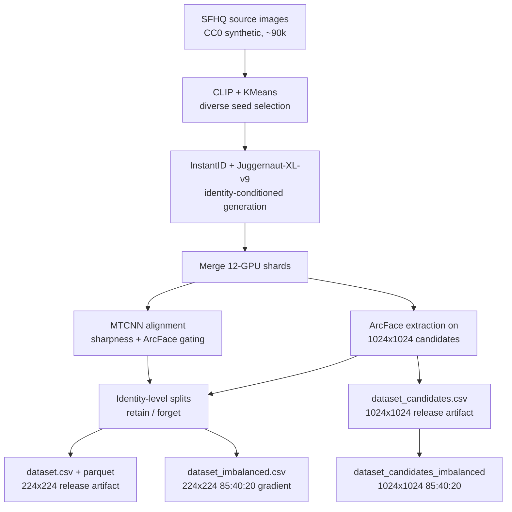

# SFHQ-VirtualID: Synthetic Identity-Conditioned Face Datasets for Machine Unlearning

[](https://huggingface.co/datasets/TODO)
[](https://huggingface.co/datasets/TODO)
[](https://doi.org/TODO)
[](https://doi.org/TODO)
[](LICENSE)

A reproducible pipeline for constructing **synthetic, identity-conditioned face
clusters** from CC0 synthetic seed images, designed as a benchmark for
**machine unlearning**.  Each identity cluster is a deletion unit — all images
of one synthetic identity share a split (`retain` / `forget`) and a
per-image `image_subset` (`train` / `holdout`).  Every identity
contributes images to both training and evaluation — no identity-level
test split that would make test accuracy structurally degenerate.

The project publishes **two complementary datasets** (see
[`DATASET_CARD.md`](DATASET_CARD.md)):

| Release | Resolution | Contents | Purpose |
|---|---|---|---|
| **SFHQ-VirtualID-Bench** | 224×224 aligned crops | Balanced (45,000) + imbalanced (~19,500) | Machine-unlearning benchmark (primary) |
| **SFHQ-VirtualID-Full** | 1024×1024 portraits | Max-size (51,000, 85/id) | General-purpose identity-conditioned faces |

## Dataset at a glance

| Property | Value |
|---|---|
| **Source domain** | SFHQ (CC0 synthetic portraits) |
| **Generation method** | InstantID + Juggernaut-XL-v9 + ControlNet |
| **Output resolution** | 224×224 (Bench, aligned crops) / 1024×1024 (Full, candidates) |
| **Identities** | 600 |
| **Images per identity** | 75 (Bench balanced) / 85 (Full) / variable (Bench imbalanced, 3-bin gradient) |
| **Total images** | 45,000 (Bench balanced) / ~19,500 (Bench imbalanced) / 51,000 (Full) |
| **Splits** | Retain 540, Forget 60 identities; per-image `image_subset` (train + holdout) |
| **Forget protocol** | 15 steps, 4 identities per step (uniform) |
| **Labels (standard)** | `identity_id`, `age_group`, `split`, `forget_step`, `forget_variant`, `image_subset`, `arcface_similarity`, `laplacian_variance`, `detection_confidence`, plus 5 metadata columns |
| **Labels (imbalanced)** | plus `popularity_bin`, `images_per_identity` on the 224 variant |
| **Metadata format** | CSV + Parquet |
| **Intended task** | Machine unlearning (identity-level deletion) |
| **Artifacts** | 3 datasets across 2 releases: Bench (224 balanced + imbalanced), Full (1024 max-size) |

## Why this dataset?

Existing unlearning benchmarks either use real face photographs (creating
ethical and privacy barriers) or treat images as independent samples (breaking
the identity-consistency constraint that makes deletion meaningful).  SFHQ-
InstantID solves both problems:

- **Synthetic, not anonymous.**  Every face is generated by a fully synthetic
  pipeline — SFHQ seeds are CC0 AI-generated portraits, and InstantID +
  Juggernaut-XL-v9 introduce controlled identity-preserving variation.  We do
  not claim the images are "anonymous" or "privacy-safe"; synthetic does not
  mean risk-free, and residual likeness or memorisation is possible.
- **Identity clusters are deletion units.**  All 75 images of identity 37 share
  the same `identity_id`, the same `split`, and (if `forget`) the same
  `forget_step`.  An unlearning system must genuinely erase a *person* rather
  than scattered pixels.
- **Sequential forget protocol.**  60 identity clusters are deleted over 15
  steps (4 identities per step at constant distribution; configurable),
  modelling real-world incremental deletion requests (GDPR / CCPA).
- **Imbalanced variant.**  A companion ``dataset_imbalanced.csv`` uses the
  same identities but prunes images to an 85:40:20 gradient (4.25:2:1 ratio),
  letting evaluators measure unlearning difficulty as a function of
  per-identity representation, mirroring real-world long-tail distributions.

## Pipeline



### Phase breakdown

| Phase | Script | Resources | Time | Description |
|---|---|---|---|---|
| 1. Download | `step1_download` | 1 CPU | ~5 min | Precomputed CLIP features + KMeans seed selection from SFHQ |
| 2. Generate | `hpc_generate.sh` | 12× L40S GPU (exclusive) | ~12 hr | 600 identities (50/shard), 85 candidates each, 100 unique prompts |
| 3. Merge | `hpc_merge.sh` | 1 CPU | ~30 min | Unify shards, remap identity IDs |
| 4. Extract | `hpc_extract.sh` | 1× GPU | ~2 hr | ArcFace embeddings + demographics on 1024×1024 candidates (detection works on full portraits) |
| 5. Preprocess | `hpc_preprocess.sh` | 1× GPU | ~4 hr | MTCNN detect + align, sharpness + ArcFace gating → 224×224 crops |
| 6. Build | `hpc_build.sh` | 1 CPU | ~15 min | All four artifacts: 224 balanced/imbalanced + 1024 balanced/imbalanced |

Extract runs on the 1024×1024 raw candidates (detection works on full
portraits — it fails on tight 224 crops, which previously degraded all
demographics to constants).  Extract and preprocess are **sibling steps**:
both consume the merge output and neither reads the other's output, so
they can run **in parallel on two GPUs** to halve the wall time.  The build
step joins their outputs through the (identity_id, trial) key and produces
four dataset pairs from a single pipeline run.

### Configuration

| Parameter | Value | Purpose |
|---|---|---|
| `dataset.nidentities` | 600 | Total identity clusters |
| `dataset.imagesperidentity` | 75 | Final images per identity |
| `dataset.candidatesperidentity` | 85 | Candidates generated per identity |
| `dataset.forget_pct` | 0.10 | Fraction of identities in forget set |
| `dataset.forget_steps` | 15 | Unlearning steps (uniform distribution) |
| `dataset.test_pct` | 0.15 | Fraction of identities in test set |
| `dataset.skip_download` | false | Skip Kaggle download if data exists locally |
| `pipeline.instantid.base_model` | `RunDiffusion/Juggernaut-XL-v9` | Base SDXL model |
| `pipeline.instantid.controlnet_conditioning_scale` | 0.80 | ControlNet spatial control |
| `pipeline.imgsize` | 224 | Final crop resolution |
| `pipeline.min_similarity_raw` | 0.40 | ArcFace gate (generate phase) |
| `pipeline.min_similarity_final` | 0.45 | ArcFace gate (preprocess phase) |
| `pipeline.blurthreshold` | 80.0 | Laplacian variance sharpness floor |

**Size guards:** `nidentities ≥ 100` enforced for download and build steps
(generate-only shards bypass this).  `forget_steps ≥ 5` enforced at build.

Hyperparameters (`guidance_scale`, `ip_adapter_scale`, `num_inference_steps`)
are model-aware — resolved from `MODEL_DEFAULTS` in `generate_identities.py`
based on the selected `base_model`.  Juggernaut: 3.0 / 0.85 / 30; SDXL base:
5.5 / 0.90 / 25.  Override via CLI (`pipeline.instantid.guidance_scale=4.0`).

### Prompt system

Prompts are defined in [`src/prompts.py`](src/prompts.py).  A **20 × 5 = 100**
grid of unique variation prompts combines

- 20 composition tuples (pose + expression + setting + camera lens)
- 5 lighting treatments (window, studio, daylight, golden hour, overcast)

Each identity gets a **deterministically shuffled** subset of 85 prompts from
the pool, seeded by the identity's cluster ID.  Every candidate in a shard
receives a unique prompt — no two candidates share the same rendering
instruction within an identity.

Full configuration in [`conf/config.yaml`](conf/config.yaml).

## Quick start

### Environment

```bash
# Create conda env (Python 3.10, CUDA 12.6)
conda create -n data_gen python=3.10 -y
conda activate data_gen
pip install torch torchvision torchaudio --index-url https://download.pytorch.org/whl/cu124
pip install xformers --index-url https://download.pytorch.org/whl/cu124
pip install -r requirements.txt
```

Detailed HPC setup: [`HPC CookBook.md`](HPC CookBook.md).

### Run on HPC (Slurm)

```bash
# Full pipeline (all 6 phases, chained with Slurm dependencies):
sbatch scripts/hpc_full_pipeline.sh

# Smoke test first (4 identities × 3 candidates, ~15 min):
sbatch scripts/hpc_smoke_test.sh

# Individual phases:
sbatch scripts/hpc_generate.sh       # 12-GPU array
sbatch scripts/hpc_merge.sh          # after generate completes
sbatch scripts/hpc_preprocess.sh     # after merge completes
sbatch scripts/hpc_extract.sh        # after extract completes
sbatch scripts/hpc_build.sh          # after extract completes
```

All data lands on Lustre scratch (`/scratch/$USER/datagen/data/`).  Model
caches stay on home storage.

### Run locally (single machine)

```bash
cd src
# Precomputed CLIP features — use --skip-download after first run:
python main.py --config-name step1_download dataset.skip_download=false
python main.py --config-name step2_generate   # generate
python main.py --config-name step4_extract    # embeddings (on 1024 candidates)
python main.py --config-name step3_preprocess # align + filter (224 crops)
python main.py --config-name step5_build      # builds all four dataset pairs
```

Note the order: extract now runs on the raw 1024×1024 candidates (Step 4)
**before** preprocess (Step 3), because InsightFace detection fails on tight
224 crops but works on full-resolution portraits.  The step numbers follow
the Hydra config filenames; the pipeline scripts chain them in the correct
order automatically.

Each step accepts Hydra overrides; see [`conf/config.yaml`](conf/config.yaml)
for all tunables.

## Output schema

### `dataset.csv` / `dataset.parquet`

| Column | Type | Description |
|---|---|---|
| `image_path` | string | Relative path: `images/identity_NNN/crop_XXX.jpg` |
| `identity_id` | int (0–599) | Synthetic identity cluster ID |
| `age_group` | int (0–3) | Proxy age label: 0=Young, 1=Adult, 2=Middle-Aged, 3=Senior. Per-image (see note below) |
| `age` | int | Raw InsightFace age estimate. Per-image (see note below) |
| `gender` | int (0/1) | InsightFace gender classifier output |
| `split` | string | `retain`, `test`, or `forget` |
| `forget_step` | int (0–14, -1) | Unlearning step; -1 for non-forget |
| `forget_variant` | int (0–N, -1) | Variant index within a forget step; -1 for non-forget |
| `arcface_similarity` | float [0,1] | Cosine similarity to identity's mean ArcFace embedding (confound control) |
| `laplacian_variance` | float | Sharpness score from quality filter (quality confound control) |
| `detection_confidence` | float | Face detector confidence (alignment quality control) |

> **Per-image age labels (by design).** `age_group` and `age` are estimated
> per image on the parent 1024×1024 candidate (InsightFace gender/age
> classifier), so a single identity can span multiple age groups — e.g.
> identity 558 ranges 23–65 across its images while remaining recognisably
> the same person.  This is a deliberate realism property: the synthetic
> identity appears at different ages, and the per-image labels prevent an
> age classifier from shortcutting to identity (`identity_id → constant
> age`).  Do not collapse to a per-identity constant when using the data.

All crops are stored as **224×224** uint8 BGR.  Downstream classifiers using
ImageNet-pretrained backbones (e.g. ResNet-18) must convert to RGB and
normalise with ImageNet statistics — `CROP_SIZE`, `IMAGENET_MEAN`,
`IMAGENET_STD` are exported from `src/common.py`.  This matches the ImageNet
training regime so pretrained features activate at full fidelity from epoch 1.

**Critical invariant:** Every `identity_id` maps to exactly one `split`.  No
identity's images are split across retain/test/forget.  This is enforced by
`validate_release.py` and must hold for any machine-unlearning evaluation to be
valid.

### `dataset_candidates.csv` / `dataset_candidates.parquet`

Full-resolution 1024×1024 candidate dataset — the raw generation outputs
before face alignment.  All 85 candidates per identity, no quality trim.
Designed as a general-purpose release for identity recognition, face
generation evaluation, demographic bias studies, and erasure-transfer
testing (does forgetting the 224 crop also hide identity in the full
context?).

| Column | Type | Description |
|---|---|---|
| `image_path` | string | Relative path: `identities/candidates/identity_NNN/candidate_YYY.png` |
| `identity_id` | int (0–599) | Synthetic identity cluster ID |
| `age_group` | int (0–3) | Proxy age label |
| `age` | int | Raw InsightFace age estimate |
| `gender` | int (0/1) | InsightFace gender classifier |
| `split` | string | `retain`, `test`, or `forget` |
| `forget_step` | int | Unlearning step |
| `forget_variant` | int | Variant index within a step |
| `arcface_similarity` | float [0,1] | Cosine similarity to identity's mean candidate embedding |
| `pose` | string | Head/body position |
| `expression` | string | Facial expression |
| `lighting` | string | Lighting condition |
| `setting` | string | Background/scene |
| `camera` | string | Camera angle |

No `laplacian_variance` or `detection_confidence` — these are crop-level
quality metrics and are meaningless on raw candidates.

An imbalanced variant (`dataset_candidates_imbalanced.csv/.parquet`) applies
the same 85:40:20 gradient, adding `popularity_bin` and `images_per_identity`
columns.

### Release summary (all artifacts)

| Release | Artifact | Resolution | Identities | Images/id | Total rows | Purpose |
|---|---|---|---|---|---|---|
| **Bench** | `dataset.csv/.parquet` | 224×224 crops | 600 | 75 | 45,000 | Dissertation unlearning benchmark |
| **Bench** | `dataset_imbalanced.csv/.parquet` | 224×224 crops | 600 | 85:40:20 | ~19,500 | Long-tail stress test |
| **Full** | `dataset_candidates.csv/.parquet` | 1024×1024 candidates | 600 | 85 | 51,000 | General-purpose release |
| **Full** | `dataset_candidates_imbalanced.csv/.parquet` | 1024×1024 candidates | 600 | 85:40:20 | ~TBD | Full-res long-tail stress test |

All four share identical `identity_id`, `split`, `forget_step`, and
`forget_variant` labels.  Demographics (age, gender) are derived from
detection on 1024×1024 candidates and are now real — no longer degenerate
from the CPU fallback path.

### `dataset_imbalanced.csv` / `dataset_imbalanced.parquet`

An extra artifact produced alongside the balanced dataset.  Shares the same
identity pool and split assignment but prunes images to an **85:40:20
gradient** (4.25:2:1 ratio) across three popularity bins:

| Bin | Identities | Images/ID | Total images |
|---|---|---|---|
| High (top 10%) | 60 | up to 85 | ~5,100 |
| Medium (30%) | 180 | 40 | 7,200 |
| Low (bottom 60%) | 360 | 20 | 7,200 |

| Column | Type | Description |
|---|---|---|
| ... | ... | All columns from the balanced schema (incl. gender, arcface_similarity, laplacian_variance, detection_confidence) |
| `popularity_bin` | string | `"high"`, `"medium"`, or `"low"` |
| `images_per_identity` | int | Actual per-identity image count (up to 85, 40, or 20) |

Designed for stress-testing the long tail: high-popularity identities
(celebrities) are over-learned and hardest to forget; low-popularity identities
are under-learned and easiest to scrub.  The 4.25× ratio between high and low
bins mirrors real-world face dataset distributions.

## What is released / what is not

| Released ✅ | Withheld ❌ |
|---|---|
| Aligned 224×224 face crops (`crop_*.jpg`) | Raw SFHQ source images (`data/seeds/`) |
| 1024×1024 candidate images (`candidates/`) | ArcFace embedding vectors |
| `dataset.csv` + `.parquet` (224 balanced) | Seed-to-output linkage table |
| `dataset_imbalanced.csv` + `.parquet` (224) | Juggernaut-XL-v9 / InstantID / ControlNet / InsightFace model weights |
| `dataset_candidates.csv` + `.parquet` (1024) | Rejected / low-quality candidate images |
| `dataset_candidates_imbalanced.csv` + `.parquet` | Logs, conda envs, model caches |
| `datasetsummary*.json` (all variants) | |
| `datasetsummary_candidates*.json` | |
| Checksums (`checksums.sha256`) | |
| Schema (`schema.json`) | |
| Release manifest (`RELEASE_MANIFEST.json`) | |

Model weights must be obtained from upstream sources by each user under the
upstream licence terms.  See [`THIRD_PARTY_NOTICES.md`](THIRD_PARTY_NOTICES.md)
for exact revisions and licence URLs.

## Limitations

- **Synthetic, not risk-free.**  Generated faces may retain artifacts,
  demographic bias, or unintended resemblance to real persons.  The dataset
  must not be used for identification, biometric authentication, surveillance,
  impersonation, or decisions affecting individuals.
- **Proxy age labels.**  Age-group fields are model-estimated (InsightFace
  gender/age classifier) and must not be interpreted as verified demographic
  attributes.
- **Reconstruction risk.**  We do not distribute seed-to-output linkage, but
  residual similarity between a synthetic identity and its single SFHQ seed
  image is inherent to the InstantID method.

See [`DATASET_CARD.md`](DATASET_CARD.md) for full composition, intended use,
and privacy policy.

## Reproducibility

| Component | Pinned value |
|---|---|
| Random seed | 42 (configurable) |
| Shard seeds | 42, 44, 46, 48, 50, 52, 54, 56, 58, 60, 62, 64 |
| Python | 3.10 |
| PyTorch | 2.6.0+cu124 |
| Diffusers | 0.39.0 |
| CUDA | 12.6 |
| GPU | NVIDIA L40S (46 GB) |
| SFHQ part | 1 (~90k source images) |

Exact model revisions are recorded in [`RELEASE_MANIFEST.json`](RELEASE_MANIFEST.json).

## Citation

```bibtex
@dataset{sfhq_virtualid_bench,
  title     = {{SFHQ-VirtualID-Bench}: Synthetic Identity-Conditioned Aligned
               Face Crops for Machine Unlearning},
  author    = {TODO},
  year      = {2026},
  version   = {1.0.0},
  doi       = {TODO},
  url       = {https://github.com/FaizPalwala/virtual-id-gen},
}

@dataset{sfhq_virtualid_full,
  title     = {{SFHQ-VirtualID-Full}: Full-Resolution Synthetic
               Identity-Conditioned Face Candidates},
  author    = {TODO},
  year      = {2026},
  version   = {1.0.0},
  doi       = {TODO},
  url       = {https://github.com/FaizPalwala/virtual-id-gen},
}
```

See [`CITATION.cff`](CITATION.cff) for the complete metadata file.

## Contributing

This is a research artifact.  Bug reports and questions are welcome via GitHub
Issues.  For feature requests or extensions, please open a discussion first.

## Licence

- **Code:** MIT (see [`LICENSE`](LICENSE)).
- **Images and metadata:** Non-commercial research use only, with an explicit
  prohibited-use clause.  Revisit toward a more permissive licence after
  upstream model output-use terms are confirmed.  See [`LICENSE`](LICENSE) for
  the full terms.
- **Third-party models:** Not included.  Each user must obtain Juggernaut-XL-v9,
  InstantID, ControlNet, and InsightFace weights from the upstream sources
  listed in [`THIRD_PARTY_NOTICES.md`](THIRD_PARTY_NOTICES.md) under those
  projects' own licence terms.

## Related resources

- SFHQ source dataset: [SelfishGene/SFHQ-dataset](https://github.com/SelfishGene/SFHQ-dataset)
- InstantID: [InstantX/InstantID](https://github.com/InstantX/InstantID)
- Juggernaut-XL-v9: [RunDiffusion/Juggernaut-XL-v9](https://huggingface.co/RunDiffusion/Juggernaut-XL-v9)
- InsightFace: [deepinsight/insightface](https://github.com/deepinsight/insightface)

## Acknowledgements

This work was undertaken on the Aire HPC system at the University of Leeds, UK.

---

*This dataset is a research artifact for machine unlearning evaluation.  It is
not intended for production identity systems, biometric authentication, or any
application that makes decisions about people.*
